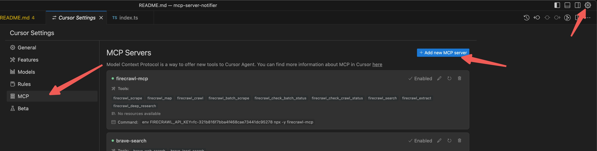

# MCP Server Notifier

A lightweight notification service that integrates with MCP (Model Context Protocol) to send webhooks when AI agents complete tasks.

[简体中文文档](./docs/README_zh.md)


## Authors
Originally created by [tuberrabbit@gmail.com](mailto:tuberrabbit@gmail.com).  
Currently maintained by [zudsniper](https://github.com/zudsniper).

## Features

- **Webhook Notifications**: Receive alerts when your AI agents complete tasks
- **Multiple Webhook Providers**: Support for Discord, Slack, Microsoft Teams, Feishu, Ntfy, and custom webhooks
- **Image Support**: Include images in notifications via Imgur
- **Multi-Project Support**: Efficiently manage notifications across different projects
- **Easy Integration**: Simple setup with AI tools like Cursor
- **Customizable Messages**: Send personalized notifications with title, body, and links

## Installation

### Option 1: Using npm

```bash
npm install -g mcp-server-notifier
```

### Option 2: Using Docker

```bash
docker pull zudsniper/mcp-server-notifier:latest

# Run with environment variables
docker run -e WEBHOOK_URL=https://your-webhook-url -e WEBHOOK_TYPE=discord zudsniper/mcp-server-notifier
```

### Option 3: From Source

```bash
git clone https://github.com/zudsniper/mcp-server-notifier.git
cd mcp-server-notifier
npm install
npm run build
```

## Integration

### Cursor Integration

1. Go to your 'Cursor Settings'
2. Navigate to Features, scroll down to MCP Servers and click on 'Add new MCP server'
   

3. Configure the server:
   - Name: `mcp-server-notifier` (or any unique name)
   - Type: `command`
   - Command: `env WEBHOOK_URL=[YOUR WEBHOOK URL] WEBHOOK_TYPE=[PROVIDER] npx -y mcp-server-notifier`

## Configuration

By default, the notifier supports several webhook types:

- Discord
- Slack
- Microsoft Teams
- Feishu
- Ntfy
- Generic JSON

You can specify the webhook type and URL through environment variables:

```bash
env WEBHOOK_URL="https://your-webhook-url" WEBHOOK_TYPE="discord" npx -y mcp-server-notifier
```

### Configuration File

For more advanced configuration, you can create a `webhook-config.json` file:

```json
{
  "webhook": {
    "type": "discord",
    "url": "https://discord.com/api/webhooks/your-webhook-url",
    "name": "My Notifier"
  },
  "imgur": {
    "clientId": "your-imgur-client-id"
  }
}
```

See the [Configuration Guide](./docs/CONFIGURATION.md) for full details and examples.

## Usage

- Ask your AI agent to notify you with a custom message when a task is complete
- Configure it as a persistent rule in Cursor settings to avoid repeating the setup

For detailed usage instructions, see the [Usage Guide](./docs/USAGE.md).

### Available Tools

1. `notify-feishu` (Legacy)
   - **Purpose**: Send simple text notifications via Feishu
   - **Input**: `message` - Text to send
   - **Best for**: Backward compatibility

2. `notify`
   - **Purpose**: Send rich notifications to any configured webhook
   - **Input**: 
     - `message` - Text content of the notification
     - `title` (optional) - Title for the notification
     - `link` (optional) - URL to include in the notification
     - `imageUrl` (optional) - URL of an image to include (supports Imgur upload)
   - **Best for**: All notification needs

## Docker Support

The MCP Server Notifier is available as a Docker image:

```bash
docker pull zudsniper/mcp-server-notifier:latest
```

Run with environment variables:

```bash
docker run -e WEBHOOK_URL=https://your-webhook-url -e WEBHOOK_TYPE=discord zudsniper/mcp-server-notifier
```

## Example Configurations

Example webhook configurations are available in the [examples](./examples) directory.

## Development

### Setting Up Development Environment

1. Clone the repository:
```bash
git clone https://github.com/zudsniper/mcp-server-notifier.git
cd mcp-server-notifier
```

2. Install dependencies:
```bash
npm install
```

3. Build the project:
```bash
npm run build
```

### Testing Your Changes

1. Run the MCP server in development mode:
```bash
# Install the MCP Inspector if you haven't already
npm install -g @modelcontextprotocol/inspector

# Start the server with the Inspector
npx @modelcontextprotocol/inspector build/index.js
```

2. The Inspector provides a web interface where you can:
   - Send requests to your tools
   - View request/response logs
   - Debug issues with your implementation

### Releasing New Versions

To release a new version:

1. Update version in `package.json`
2. Push changes to the `release` branch
3. GitHub Actions will automatically:
   - Run tests
   - Build and push Docker images
   - Publish to npm
   - Create a GitHub Release

Required repository secrets for CI/CD:
- `DOCKERHUB_USERNAME` - Docker Hub username
- `DOCKERHUB_TOKEN` - Docker Hub access token
- `NPM_TOKEN` - npm access token

## License

MIT License - see LICENSE file for details.

## Contributing

Contributions are welcome! Please feel free to submit a Pull Request.
